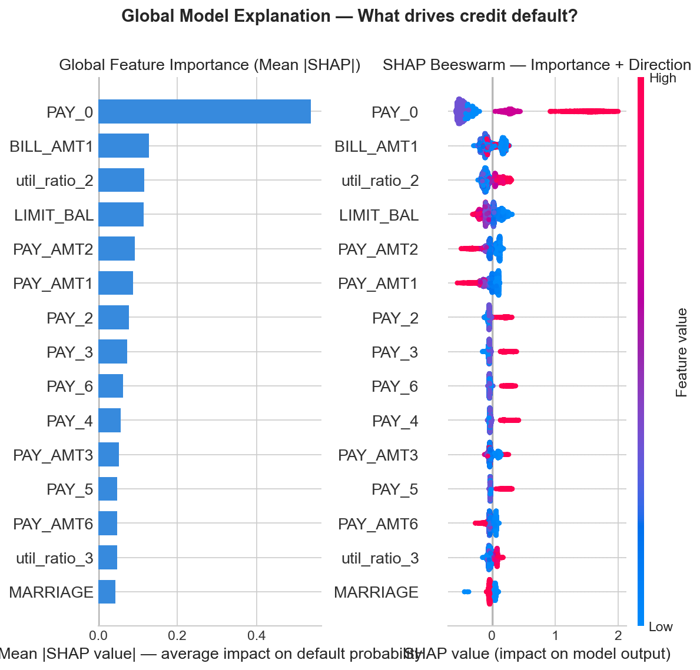
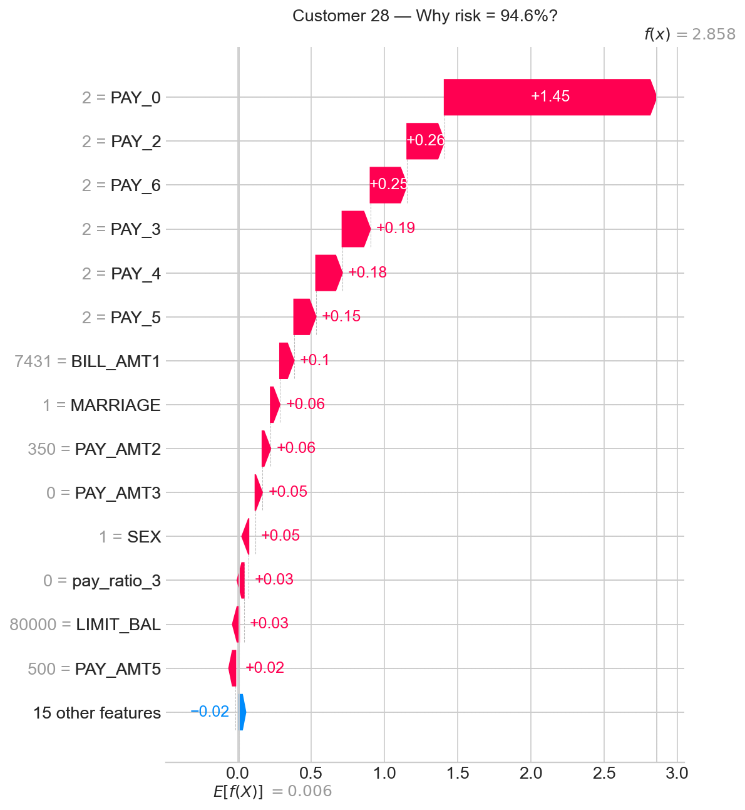

# Interpretable Credit Scoring (XGBoost + SHAP)

Making credit risk ML models explainable for BFSI compliance.

**Author:** Vishalini Satheesh  
M.E. CSE (Operational Research) · Anna University
---

## Why this project exists

Banks use ML models to decide who gets credit. In India, RBI's Model Risk 
Management guidelines require that these automated decisions be explainable 
to auditors, to regulators, and to the customers themselves.

A model that says "denied" with no reason is not just unhelpful ,it is a 
compliance risk. This project builds a credit scoring model and then uses SHAP 
to explain every single prediction at both the portfolio level and the 
individual customer level.

---

## Results

ROC-AUC : 0.78 
Default Recall : 0.62 
Dataset size : 30,000 customers 
eatures used : 30 (23 original + 6 engineered + 1 dropped) 

ROC-AUC of 0.78 matches published academic benchmarks on this dataset.

---

## What this project demonstrates

### 1. Feature-level explanation with SHAP
SHAP (SHapley Additive exPlanations) assigns each feature a precise contribution to every individual prediction. Grounded in cooperative game theory , the values are mathematically guaranteed to sum to the exact difference between the prediction and the dataset average.

**Global view** - which features drive default risk across the whole portfolio:

**Local view** — exactly why one specific customer was flagged as high risk:

**Key finding:** PAY_0 (most recent payment delay) is the single strongest 
predictor of "default". Customers with 2+ months of delay AND low credit limits 
are at compounded risk - an interaction invisible in standard feature importance 
plots but clearly visible in SHAP dependence plots.

Feature :  "PAY_0 contributed +0.31 to risk" 
Intrepretable model : "Poor payment behaviour is the primary risk driver" 

SAHP groups raw features into human understandable concepts like Payment Behaviour, 
Credit Utilisation, Repayment Capacity and explains predictions at that level. 
This is what compliance officers and bank managers can actually act on, without 
understanding the model's internals.

---

## Technical decisions worth noting

**Why XGBoost, not logistic regression?**  
Credit default is non-linear risk spikes sharply at payment delay thresholds, 
not gradually. XGBoost captures these threshold effects. Logistic regression is 
included as a baseline in the notebook for comparison.

**Why ROC-AUC, not accuracy?**  
With 78% non defaulters, a model predicting "never default" gets 78% accuracy 
but catches zero actual defaults. ROC-AUC measures ranking quality does the model correctly rank high risk customers above low risk ones.

**Why not scale features?**  
XGBoost is tree based , it splits at thresholds, not distances. Scaling changes 
nothing about the model but makes SHAP values harder to interpret. Deliberately 
skipped.

**Why `scale_pos_weight=3.5`?**  
The 78/22 imbalance means XGBoost would otherwise learn to always predict 
"no default." This parameter tells the model to treat each defaulter as 3.5 
customers during training, forcing it to actually learn the minority class.

---

## Dataset

UCI "Default of Credit Card Clients"  
Source: https://archive.ics.uci.edu/ml/datasets/default+of+credit+card+clients  
30,000 records · 23 features · Binary default label · No PII · Publicly available

Download the `.xls` file and place it in the `data/` folder before running the notebook.

---

## Project structure
credit-scoring-interpretable-ml/
│
├── notebooks/
│   └── credit_scoring_shap.ipynb   ← main notebook (run this)
├── data/                            ← place dataset here (gitignored)
├── outputs/                         ← generated plots (committed)
│   ├── class_distribution.png
│   ├── eda_plots.png
│   ├── model_performance.png
│   ├── xgb_feature_importance.png
│   ├── shap_global.png
│   ├── shap_waterfall_customer.png
│   └── shap_dependence.png
├── requirements.txt
├── .gitignore
└── README.md

## Tech stack

Python · XGBoost · SHAP · Pandas · NumPy · Scikit-learn · Matplotlib · Seaborn · Jupyter